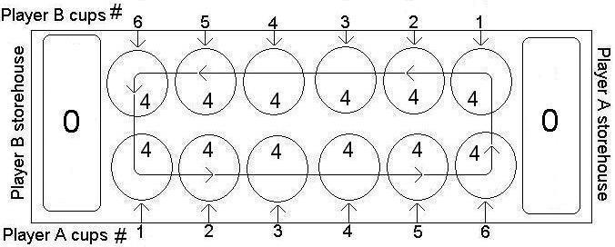
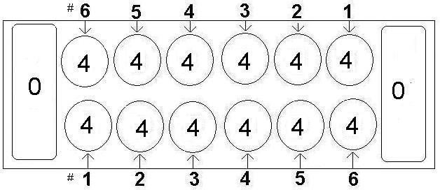
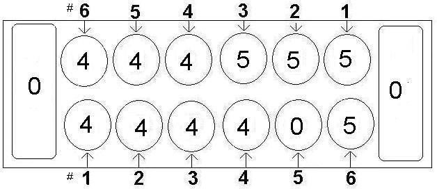
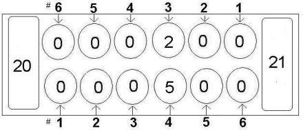
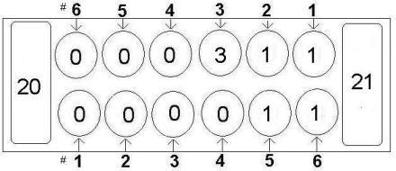
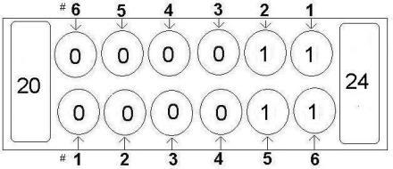
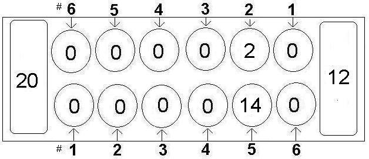
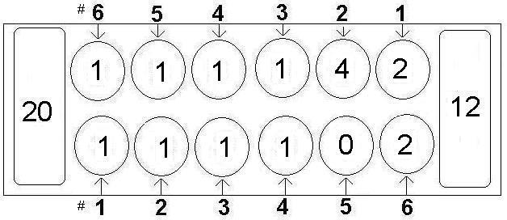

# Awari
This project implemented the Alpha-Beta pruning algorithm to play a two-player game called Awari.
 
RULES:
Awari is an Ashanti abstract strategy game in the Mancala family of board games (pit and pebble games) played worldwide. Here we will use slightly modified Abapa rules set out by Awari International for tournaments. They are as follows:
The objective is to win stones by placing your last stone being moved into a pit of your opponent that already contains one or two stones, making the final count two or three, and then capturing and placing these stones into your storehouse.

Board and initial setup:
The board is comprised of twelve pits. Each side belongs to one player. The numbers in each pit represents the number of stones in that pit.

The direction of play is counterclockwise, moving left to right around the board in a circle. Each player has six pits on one side of the board and a storehouse to their right, which is for storing stones won during the game. To start the game, place a constant number (usually 4) stones into each player’s pits, and none in the storehouse. 

Rule 1: MOVING.	On their turn, the player chooses any pit on their side, removes all the stones in that pit, and, starting at the next pit to the right moving counterclockwise, puts one stone into each pit that comes next without skipping any pits, except the pit moved from and the storehouses. For example:

Before                                                                         After

 

Rule 2: WINNING STONES IN ONE PIT.	If a player places their last stone into a pit on the opponent’s side that makes the new count in that pit either 2 or 3 stones, the player wins these stones and places them in their storehouse. For example: 
Before move                        After move, before capture                            After capture

  

Rule 3: WINNING STONES IN MULTIPLE PITS.    If the last stone does capture the pit’s stones, then the previous pit is checked. If that pit, too, has a count of 2 or 3 stones, then those stones are also placed into the current player’s storehouse, and the pit previous to it is checked next. This capturing continues until a checked pit cannot be captured, or it resides outside your opponent’s set of pits.

Important Note: No capture is possible if it would leave an opponent with no stones in any of their pits. That is, you cannot entirely wipe-out an opponent in one move (known as a grand-slam). The move is allowed, but no capture will occur.

Rule 4: SKIPPING PITS.	If a player chooses a pit containing 12 or more stones, the player will skip the pit they started from and continue to the next pit. For example:

Before move                                                                 After move

 

Rule 5: MANDATORY MOVE.	If any player has six empty pits, the next player must move at least 1 stone into the pits of the empty player if they have any pits with enough stones to reach an empty pit. If not, the game ends and the remainder of the stones are forfeit. The player with the largest number of stones in their storehouse is the winner.

The game also ends when, at any time, a player has captured a majority of the stones, which in the standard game is 25 of the 48 total stones.

This project handles all of the game board data structures, rule aspects of the game, and provides a GUI interface for practicing. In this framework there is an abstract class defined in the file Player.java, which defines all the methods necessary for an agent to interface with the game framework. Use this command to run the game:

    % javac *.java 
    % java Awari <Player1Class> <Player2Class> <board.txt> [maxDepth]

The first two arguments are the playing agents’ class names, the third argument is a text file for board setup, and the last argument is the maximum search depth for the AI (it is not required when both players are human). This program has provided a human player class, HumanPlayer, which takes input from the GUI interface.

The first line in the setup file defines the current scores for players 1 and 2 respectively, and the next two lines define the number of stones in each of the pits. For example, the setup file for the default initial board state is:

    0 0 
    4 4 4 4 4 4 
    4 4 4 4 4 4 

Note we may use different board states in testing. When the game is run with no parameters, it is a two-human-player practice game with the default initial board setup.
